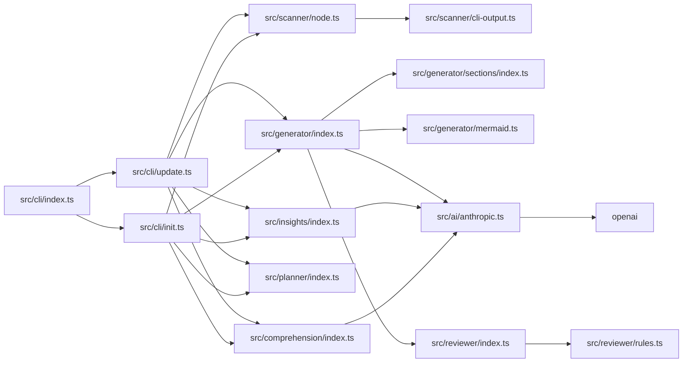

<h1 align="center">readme-craft</h1>
<p align="center">基于 AI 的 README 文档自动生成 CLI 工具，通过渐进式项目理解实现结构化文档的全量生成与增量更新（readme-craft）</p>
<p align="center">
  
  </p>
<p align="center">
  <a href="#项目简介">项目简介</a> •
  <a href="#功能特性">功能特性</a> •
  <a href="#快速开始">快速开始</a> •
  <a href="#使用示例">使用示例</a> •
  <a href="#项目结构">项目结构</a> •
  <a href="#配置说明">配置说明</a> •
  <a href="#技术栈">技术栈</a> •
  <a href="#贡献指南">贡献指南</a> •
  <a href="#许可证">许可证</a>
</p>

---

## 项目简介

readme-craft 是一个 CLI 工具，通过五阶段流水线从项目源码生成结构化 README，支持全量生成（`init`）和基于快照差异的增量更新（`update`）。

直接让 AI 一次性生成 README 的常见问题是：AI 拿到的上下文太浅，产出内容要么空泛要么带占位符（`your-org`、`TBD`），和实际代码脱节。readme-craft 把这个过程拆成五个串行阶段，每阶段的输出喂给下一阶段，逐步加深对项目的理解：`scanProject` 扫描目录结构、入口点、核心模块和配置文件 → `buildProjectUnderstanding` 以 `temperature=0.1` 提取七维结构化理解并做两轮精炼 → `buildProjectInsights` 从入口、热文件、核心模块中采集最多 8 个代码片段作为证据 → `planReadmeOutline` 动态规划章节（通过 inquirer checkbox 交互确认，或 `-y` 跳过）→ `generateReadmeSections` 逐节生成内容并经过双重质量审查循环。

质量门控是区别于一次性生成的关键机制。每个章节生成后，`reviewSectionQuality`（`src/reviewer/index.ts`）先执行 6 项确定性规则检查——安装步骤是否存在、命令是否可运行、是否包含代码示例、链接格式是否合法、徽章语法是否正确、是否残留占位符（通过 `/\[TODO\]|\bTBD\b|your-org|your-username/i` 正则匹配）——再由 AI 从 clarity、completeness、accuracy、actionability 四个维度打分，最终按 `overallScore = AI均分 × 0.8 + 规则通过率 × 0.2` 加权合成。不达标的章节会携带上一轮的 `quality.issues` 作为中文反馈注入 prompt 自动重写，最多重试 `maxRegenerationAttempts` 轮。

`update` 命令不会全量重新生成。它通过 `buildSnapshot`/`readSnapshot` 生成项目快照，`detectChangedSections`（`src/cli/update.ts`）比对前后快照差异并映射到章节 ID，只对变更章节重新走生成+审查流程，再由 `mergeReadmeSections` 合并回现有文档。这意味着首次 `readme-craft init`，后续代码变更后只需 `readme-craft update`，未变更章节保持不动。

<details>
<summary>关于章节写作规范的补充</summary>

每种章节类型在 `buildSectionRequirements`（`src/generator/sections/index.ts`）中配备独立的中文写作规范，包含具体约束：quickstart 章节禁止出现占位符仓库地址、优先使用项目实际存在的 `scripts` 和 `bin` 名称；structure 章节要求目录树放进 `<details>` 折叠块；contributing 章节要求结合真实 scripts 给出建议且不假装存在测试命令。这些规范以硬编码 `requirements` 字典的形式存在，牺牲了灵活性但确保输出一致性。

</details>

---

## 架构概览



---

## 功能特性

1. **五阶段渐进式流水线，非一次性生成。** `readme-craft init` 依次执行：`scanProject`（扫描目录结构、入口点、核心模块、热文件、配置文件）→ `buildProjectUnderstanding`（temperature=0.1，两轮精炼，输出七维 JSON：oneLiner/problem/solution/architecture/keyFeatures/targetAudience/techHighlights）→ `buildProjectInsights`（从入口、热文件、核心模块中采集最多 8 个代码片段，temperature=0.15）→ `planReadmeOutline`（10 种候选章节，inquirer checkbox 交互选择，`-y` 跳过）→ `generateReadmeSections`（逐节生成 + 质量审查循环）。每阶段输出喂给下一阶段，而非把所有信息一次性丢给模型。

2. **双重质量门控 + 闭环重写。** 每个章节生成后经过 `reviewSectionQuality`（`src/reviewer/index.ts`）两层检查：`runRuleChecks` 执行 6 项确定性布尔规则（安装步骤存在性、命令可运行性、代码示例、链接格式、徽章正确性、无占位符——通过正则 `/\[TODO\]|\bTBD\b|your-org|your-username|example-repo/i` 拦截），加上 AI 四维评分（clarity/completeness/accuracy/actionability，各 1-10）。综合分 `overallScore = AI均分 × 0.8 + 规则通过率 × 10 × 0.2`。不达标时，`regenerationHint` 将上一轮 `quality.issues` 拼接为中文反馈注入下一轮 prompt，最多重试 `maxRegenerationAttempts` 轮（默认 2，可在 `.readme-craft.yml` 配置）。

3. **增量更新：只重写变更章节。** `readme-craft update` 通过 `buildSnapshot` / `readSnapshot` 生成项目快照，`detectChangedSections`（`src/cli/update.ts`）比对前后快照差异并映射到章节 ID，`updateOutline` 仅启用变更章节，生成后由 `mergeReadmeSections` 精确合并回现有 Markdown。未变更章节原文保留，避免全量重新生成的 token 开销。

4. **章节专属 prompt 工程，10 种章节各有独立写作规范。** `buildSectionPrompt`（`src/generator/sections/index.ts`）为每种章节组装不同上下文：quickstart/usage 注入 bin 命令和 CLI 帮助输出，structure 注入目录树和模块导出摘要，api 注入路由端点。`buildSectionRequirements` 为每种章节定义中文约束规则，例如 quickstart 禁止占位符仓库地址、要求优先使用真实 package scripts；structure 要求目录树放进 `<details>` 折叠块、至少指出 3 个核心模块的调用关系。

   <details>
   <summary>全部 10 种章节 ID</summary>

   `overview` · `features` · `quickstart` · `usage` · `api` · `configuration` · `structure` · `tech-stack` · `contributing` · `license`

   其中 `api` 和 `configuration` 根据 `routeEndpoints` / `configurationFiles` 是否存在条件启用。
   </details>

5. **CLI 帮助输出自动捕获与清洗。** `captureCliHelp`（`src/scanner/cli-output.ts`）读取 `package.json` 的 `bin` 字段，通过 `resolveDevEntry` 将 `dist/` 路径映射为 `src/*.ts`，优先尝试 `npx tsx <devEntry> --help`，回退到 `node <distEntry> --help`。输出经 `stripAnsi`（正则 `ANSI_PATTERN`）剥离控制字符后，注入 quickstart 和 usage 章节的生成上下文。

6. **多 AI 提供商，分级 temperature 策略。** 通过 `AIProvider` 接口（`src/ai/provider.ts`）统一 Anthropic 和 OpenAI 调用。`AnthropicProvider`（`src/ai/anthropic.ts`）内部将 system 消息从 messages 数组分离、过滤为 user-only messages 以适配 Anthropic API，`max_tokens` 固定 4096，默认 temperature 0.2。三个阶段使用不同 temperature：理解 0.1、洞察 0.15、生成 0.2。提供商、模型名、API 端点均可通过 `.readme-craft.yml` 或 CLI 选项 `-m` / `-c` 覆盖。

---

## 快速开始

需要 Node.js >= 18，npm >= 8。需要至少配置一个 AI 提供商的 API Key（Anthropic 或 OpenAI）。

```bash
# 1. 安装依赖并构建
npm install && npm run build

# 2. 配置 API Key（二选一）
cp .env.example .env
# 编辑 .env，填入 ANTHROPIC_API_KEY 或 OPENAI_API_KEY

# 3. 对目标项目生成 README（-y 跳过交互式章节选择）
readme-craft init /path/to/target-project -y

# 4. 后续代码变更后，增量更新已有 README
readme-craft update /path/to/target-project
```

`init` 执行完整的五阶段流水线（扫描→理解→洞察→规划→生成+审查），首次运行耗时取决于项目规模和 AI 响应速度。`update` 通过快照差异比对只重新生成变更章节，不会全量重写。

以下为实际 CLI 输出：

```
Usage: readme-craft [options] [command]

Generate high-quality README files with progressive project understanding

Options:
  -V, --version              output the version number
  -h, --help                 display help for command

Commands:
  init [options] [target]
  update [options] [target]
  help [command]             display help for command
```

<details>
<summary>其他安装方式</summary>

从源码直接运行（不构建）：

```bash
npm install
# 通过 tsx 直接执行 TypeScript 源码
npm run dev -- init /path/to/target-project -y
```

构建后通过 node 直接调用入口：

```bash
npm run build
node ./dist/cli/index.js init /path/to/target-project
```

全局链接到系统 PATH（开发调试用）：

```bash
npm install && npm run build
npm link
# 之后可在任意目录使用
readme-craft init . -y
```

</details>

<details>
<summary>配置文件说明</summary>

除 `.env` 中的 API Key 外，可在目标项目根目录放置 `.readme-craft.yml` 自定义生成策略。参考仓库中的 `.readme-craft.yml.example`。

CLI 选项可覆盖配置文件：`-c` 指定配置路径，`-m` 指定 AI 模型，`-l` 指定语言，`-o` 指定输出文件名，`-y` 跳过所有交互确认。

</details>

---

## 使用示例

### 全量生成 README

```bash
readme-craft init
```

在当前目录执行五阶段流水线（扫描→理解→洞察→规划→生成+审查），交互式选择章节后生成完整 README.md。

跳过交互确认：

```bash
readme-craft init -y
```

指定目标目录和输出路径：

```bash
readme-craft init ./my-project -o docs/README.zh.md
```

### 增量更新 README

```bash
readme-craft update
```

读取 `.readme-craft-snapshot.json` 快照，比对项目变更，仅重新生成变更章节并合并回现有 README.md。适合持续维护文档。

### 自定义配置

创建 `.readme-craft.yml`：

```yaml
model: claude-3-5-sonnet-20241022
language: zh
outputFile: README.md
maxRegenerationAttempts: 3
```

通过 CLI 选项覆盖配置：

```bash
readme-craft init -m gpt-4o -l en -c .readme-craft.custom.yml
```

### 实际 CLI 输出

以下为 `readme-craft --help` 的实际输出：

```
Usage: readme-craft [options] [command]

Generate high-quality README files with progressive project understanding

Options:
  -V, --version              output the version number
  -h, --help                 display help for command

Commands:
  init [options] [target]
  update [options] [target]
  help [command]             display help for command
```

<details>
<summary>init 命令选项</summary>

```bash
readme-craft init --help
```

- `-c, --config <path>`: 指定配置文件路径
- `-m, --model <model>`: 覆盖模型名称（如 `claude-3-5-sonnet-20241022` 或 `gpt-4o`）
- `-l, --language <lang>`: 输出语言，默认 `zh`
- `-o, --output <file>`: 输出文件路径，默认 `README.md`
- `-y, --yes`: 跳过最终确认，直接生成

</details>

<details>
<summary>update 命令选项</summary>

```bash
readme-craft update --help
```

选项与 `init` 一致，但执行增量更新流程：读取快照 → 比对差异 → 仅重新生成变更章节 → 合并回现有文档。

</details>

### 典型工作流

1. 项目初始化后执行 `readme-craft init -y` 生成首版 README
2. 代码变更后执行 `readme-craft update` 增量更新文档
3. 通过 `.readme-craft.yml` 固化团队配置（模型、语言、输出路径）
4. CI 流程中集成 `readme-craft update -y` 自动同步文档

---

## 项目结构

`src/` 下按职责分为 8 个子模块，数据沿五阶段流水线单向流动：

```
cli (入口) → scanner (扫描) → comprehension (理解) → insights (洞察) → planner (规划) → generator (生成) ↔ reviewer (审查)
                                                                                              ↓
                                                                                           ai (调用层)
```

`src/cli/index.ts` 是 Commander.js 入口，解析 `init` / `update` 子命令后分别调用 `src/cli/init.ts` 和 `src/cli/update.ts`。两条路径共享同一条流水线，区别在于 `update` 额外执行快照差异比对（`src/utils/snapshot.ts` 中的 `buildSnapshot` / `readSnapshot` / `detectChangedSections`），只重新生成变更章节。

以下是 3 个核心模块的职责边界和调用关系：

- `src/comprehension/index.ts` — 项目理解层。`buildProjectUnderstanding` 先调用 `scanProject` 的输出构建初始 prompt，以 `temperature=0.1` 请求 AI 返回七维 JSON（oneLiner/problem/solution/architecture/keyFeatures/targetAudience/techHighlights）；随后 `loadEntrySources` 读取入口源码，发起第二轮精炼。输出的 `ProjectUnderstanding` 被下游 insights、planner、generator 三个模块消费。

- `src/generator/index.ts` + `src/generator/sections/index.ts` — 章节生成层。`generateReadmeSections` 串行遍历 planner 输出的启用章节列表，对每个章节调用 `buildSectionPrompt` 组装章节专属上下文（`buildSectionContext` 根据 `section.id` 动态注入 bin 命令、CLI 帮助输出、目录树、模块导出摘要等不同数据）和中文写作规范（`buildSectionRequirements`，10 种章节各有独立约束）。生成后进入 `reviewSectionQuality` 审查，不达标则将 `quality.issues` 拼接为 `regenerationHint` 注入下一轮 prompt，最多重试 `maxRegenerationAttempts` 轮。

- `src/reviewer/index.ts` + `src/reviewer/rules.ts` — 双重质量门控。`runRuleChecks` 执行 6 项确定性布尔检查（安装步骤、可运行性、代码示例、链接有效性、徽章正确性、无占位符），`runAIReview`（`src/reviewer/ai-review.ts`）返回四维 1-10 评分。最终 `overallScore = AI均分 × 0.8 + 规则通过率 × 0.2`。这个模块只被 generator 调用，不直接接触 AI provider 以外的外部状态。

其余模块的职责：

- `src/ai/` — AI 调用抽象层。`provider.ts` 定义 `AIProvider` 接口，`anthropic.ts` 和 `openai.ts` 分别实现。`AnthropicProvider` 内部将 system 消息从 messages 数组分离，过滤为 user-only messages 以适配 Anthropic API。默认 `max_tokens: 4096`，`temperature: 0.2`。
- `src/scanner/` — 项目扫描。`index.ts` 扫描目录结构、入口点、核心模块、热文件；`cli-output.ts` 的 `captureCliHelp` 执行项目 bin 命令捕获帮助输出，通过 `ANSI_PATTERN` 正则剥离控制字符，`resolveDevEntry` 将 `dist/` 路径映射为 `src/*.ts`。
- `src/planner/` — 大纲规划。`buildSections` 构建 10 种候选章节（8 个通用 + api/configuration 按 `routeEndpoints`/`configurationFiles` 条件启用），通过 inquirer checkbox 交互或 `skipPrompt` 跳过。
- `src/utils/` — 工具函数集合，包括配置加载（`config.ts`）、快照管理（`snapshot.ts`）、Markdown 处理（`markdown.ts`）、JSON 安全解析（`json.ts`）等。
- `src/types/` — 全局类型定义。

<details>
<summary>完整目录结构</summary>

```
.
├── .env                          # 环境变量（AI provider key 等）
├── .env.example
├── .readme-craft/
│   └── last-output.txt           # 上次生成的原始输出
├── .readme-craft.yml             # 项目级配置（模型、语言、输出路径等）
├── .readme-craft.yml.example
├── package.json
├── tsconfig.json
└── src/
    ├── ai/
    │   ├── provider.ts           # AIProvider 接口定义
    │   ├── anthropic.ts          # Anthropic 实现（system prompt 分离）
    │   ├── openai.ts             # OpenAI 实现
    │   └── index.ts              # createAIProvider 工厂
    ├── cli/
    │   ├── index.ts              # Commander.js 入口，注册 init/update
    │   ├── init.ts               # runInitCommand 全量生成流程
    │   └── update.ts             # runUpdateCommand 增量更新流程
    ├── comprehension/
    │   ├── index.ts              # buildProjectUnderstanding（两轮精炼）
    │   └── prompts.ts            # 理解阶段的 prompt 模板
    ├── generator/
    │   ├── index.ts              # generateReadmeSections + 重试循环
    │   ├── mermaid.ts            # Mermaid 图生成 / sanitize / validate
    │   └── sections/             # buildSectionPrompt / buildSectionContext / buildSectionRequirements
    ├── insights/
    │   └── index.ts              # buildProjectInsights + collectInsightEvidence（最多 8 片段）
    ├── planner/
    │   └── index.ts              # planReadmeOutline + inquirer 交互
    ├── reviewer/
    │   ├── index.ts              # reviewSectionQuality（加权合成 overallScore）
    │   ├── rules.ts              # runRuleChecks（6 项确定性检查）
    │   └── ai-review.ts          # runAIReview（4 维 AI 评分）
    ├── scanner/
    │   ├── index.ts              # scanProject 主扫描逻辑
    │   ├── cli-output.ts         # captureCliHelp + ANSI 清洗
    │   └── node.ts               # Node.js 项目特定扫描
    ├── types/
    │   └── index.ts              # 全局类型（ProjectContext, QualityCheck 等）
    └── utils/
        ├── config.ts             # loadConfig（.readme-craft.yml + CLI 选项合并）
        ├── snapshot.ts           # buildSnapshot / readSnapshot / detectChangedSections
        ├── markdown.ts           # mergeReadmeSections / upsertArchitectureSection
        ├── fs.ts                 # safeReadFile / resolveReadmePath
        ├── json.ts               # 安全 JSON 解析
        ├── log.ts                # 日志工具
        └── project-type.ts       # 项目类型推断
```

</details>

---

## 配置说明

readme-craft 的配置分三层：环境变量（`.env`）、项目配置文件（`.readme-craft.yml`）、CLI 选项。优先级从低到高：`.readme-craft.yml` < `.env` < CLI 选项。

### 环境变量

项目根目录创建 `.env` 文件（参考 `.env.example`）：

```bash
# 二选一，取决于你使用哪个 AI 提供商
OPENAI_API_KEY=
ANTHROPIC_API_KEY=
```

CLI 入口（`src/cli/index.ts`）启动时通过 `dotenv` 加载这些变量。`createAIProvider`（`src/ai/index.ts`）根据当前选择的提供商读取对应的 key：

- 选择 Anthropic → 读 `ANTHROPIC_API_KEY`，由 `AnthropicProvider`（`src/ai/anthropic.ts`）使用，默认 `max_tokens: 4096`，`temperature: 0.2`
- 选择 OpenAI → 读 `OPENAI_API_KEY`，由 `OpenAIProvider`（`src/ai/openai.ts`）使用

没有设置对应 key 时，AI 调用阶段会直接报错。两个 key 都设置的情况下，由 `-c` 选项或 `.readme-craft.yml` 中的提供商配置决定使用哪个。

### 项目配置文件

`.readme-craft.yml` 放在项目根目录。仓库中有 `.readme-craft.yml.example` 作为参考模板。

配置通过 `loadConfig` 函数加载，影响以下流程：

| CLI 选项 | 作用 | 影响的流程阶段 |
|---------|------|--------------|
| `-c` | AI 提供商选择 | `createAIProvider` 工厂决定实例化 Anthropic 还是 OpenAI |
| `-m` | 模型名称 | 传入 AI 调用的 model 参数，贯穿理解、洞察、生成、审查全部阶段 |
| `-l` | 输出语言 | 影响 `buildSectionPrompt` 中的写作规范和 prompt 语言 |
| `-o` | 输出文件路径 | 最终 Markdown 写入的目标路径，默认行为是写入 `README.md` |
| `-y` | 跳过交互确认 | `planReadmeOutline` 中跳过 inquirer checkbox，直接使用默认启用的章节 |

CLI 选项会覆盖 `.readme-craft.yml` 中的同名配置。

<details>
<summary>关于 .readme-craft.yml 的已知限制</summary>

`.readme-craft.yml` 的完整字段列表需要查看 `loadConfig` 的实现源码确认。从 CLI 选项和代码流程可以确认上述五个维度的配置是支持的，但 yml 文件中是否有额外字段（如 `maxRegenerationAttempts`、章节启用/禁用列表等），需要参考 `.readme-craft.yml.example` 或阅读 `loadConfig` 源码。

</details>

### AI 调用参数

不同流水线阶段使用不同的 temperature，这是硬编码的设计取舍，不通过配置文件暴露：

| 阶段 | 模块 | temperature | 原因 |
|------|------|------------|------|
| 项目理解 | `src/comprehension/index.ts` | 0.1 | 结构化 JSON 输出需要高确定性 |
| 洞察提取 | `src/insights/index.ts` | 0.15 | 允许轻微发散以发现代码模式 |
| 章节生成 | `src/generator/index.ts` | 0.2 | 平衡可读性与准确性 |

这些值不可通过配置修改。如果需要调整，直接改源码。

### TypeScript 编译配置

`tsconfig.json` 使用 `NodeNext` 模块系统，编译目标 ES2022：

```jsonc
{
  "compilerOptions": {
    "target": "ES2022",
    "module": "NodeNext",
    "moduleResolution": "NodeNext",
    "rootDir": "src",
    "outDir": "dist",
    "strict": true,
    "noUncheckedIndexedAccess": true,
    "exactOptionalPropertyTypes": true
  },
  "include": ["src/**/*.ts"]
}
```

开启了 `noUncheckedIndexedAccess` 和 `exactOptionalPropertyTypes`，这意味着贡献代码时所有索引访问需要处理 `undefined`，可选属性不能赋值 `undefined`（除非类型显式包含）。

构建命令：

```bash
npm run build    # tsc -p tsconfig.json → 输出到 dist/
npm run check    # tsc --noEmit 仅类型检查
npm run dev      # tsx src/cli/index.ts 直接运行源码
```

`captureCliHelp`（`src/scanner/cli-output.ts`）在捕获 CLI 帮助输出时，会通过 `resolveDevEntry` 将 `dist/` 路径映射回 `src/` 的 `.ts` 文件，优先用 `npx tsx` 执行。所以开发阶段不需要先 build 也能正常运行 `init`/`update`。

---

## 技术栈

TypeScript 编写，编译目标和模块系统由 `tsconfig.json` 控制，`tsc -p tsconfig.json` 构建到 `dist/`，开发时通过 `tsx src/cli/index.ts` 直接运行源码跳过编译。项目无测试框架、无 bundler，构建链路只有 `tsc`。

运行时依赖 7 个，各自职责明确：

- `commander` ^14.0.0 — CLI 入口框架，`src/cli/index.ts` 用它注册 `init` 和 `update` 两个子命令及 `-c/-m/-l/-o/-y` 等选项
- `@anthropic-ai/sdk` ^0.79.0 — `src/ai/anthropic.ts` 中 `AnthropicProvider` 调用 Anthropic Messages API，内部将 system 消息从 messages 数组分离、过滤为 user-only messages 以适配其 API 约束，默认 `max_tokens: 4096`，`temperature` 默认 0.2
- `openai` ^5.12.2 — `src/ai/openai.ts` 中实现 `OpenAIProvider`，与 `AnthropicProvider` 共享 `AIProvider` 接口，通过 `createAIProvider` 工厂按配置切换
- `dotenv` ^17.3.1 — 加载 `.env` 文件中的 API 密钥和配置，在 CLI 入口早期调用
- `js-yaml` ^4.1.0 — 解析 `.readme-craft.yml` 配置文件（`loadConfig`），支持用户自定义生成策略、输出路径、语言等
- `inquirer` ^12.9.6 — `src/planner/index.ts` 中用 checkbox 类型交互让用户选择启用哪些 README 章节，`-y` 跳过时不调用
- `simple-git` ^3.28.0 — `update` 流程中用于快照比对相关的 git 操作，支撑 `buildSnapshot`/`readSnapshot` 的增量更新机制

开发依赖 4 个：`typescript` ^5.9.3 负责类型检查和编译；`tsx` ^4.20.5 用于 `npm run dev` 直接执行 `.ts` 源码，也被 `captureCliHelp` 在运行时通过 `npx tsx` 执行目标项目的 TypeScript 入口；`@types/node` ^24.5.2 和 `@types/js-yaml` ^4.0.9 提供类型定义。

AI 调用在不同阶段使用分级 temperature：项目理解 `buildProjectUnderstanding` 用 0.1，洞察提取 `buildProjectInsights` 用 0.15，章节内容生成和 Mermaid 图生成用 0.2。所有 AI 调用通过 `AIProvider` 接口统一，切换提供商不影响上层流水线逻辑。

项目不依赖任何前端框架、ORM 或 HTTP 服务端库——它是纯 CLI 工具，`src/` 下按职责分为 `ai`、`cli`、`comprehension`、`insights`、`planner`、`generator`、`reviewer`、`scanner` 八个子模块。

<details>
<summary>依赖清单</summary>

| 类型 | 包名 | 版本 | 项目中的用途 |
|------|------|------|-------------|
| runtime | `@anthropic-ai/sdk` | ^0.79.0 | `AnthropicProvider`，Anthropic Messages API 调用，system prompt 分离 |
| runtime | `commander` | ^14.0.0 | CLI 命令注册（init/update）、选项解析 |
| runtime | `dotenv` | ^17.3.1 | 加载 `.env` 中的 API 密钥和环境变量 |
| runtime | `inquirer` | ^12.9.6 | 交互式 checkbox 选择 README 章节 |
| runtime | `js-yaml` | ^4.1.0 | 解析 `.readme-craft.yml` 配置文件 |
| runtime | `openai` | ^5.12.2 | `OpenAIProvider`，OpenAI API 调用 |
| runtime | `simple-git` | ^3.28.0 | 增量更新的 git 快照比对 |
| dev | `typescript` | ^5.9.3 | 编译（`npm run build`）和类型检查（`npm run check`） |
| dev | `tsx` | ^4.20.5 | 开发运行（`npm run dev`）、运行时 CLI 输出捕获 |
| dev | `@types/node` | ^24.5.2 | Node.js 类型定义 |
| dev | `@types/js-yaml` | ^4.0.9 | js-yaml 类型定义 |

</details>

---

## 贡献指南

欢迎提交 PR。项目当前为单人维护，接受功能增强和 bug 修复。

基本质量要求：

- PR 必须通过 `npm run check`（`tsc --noEmit`），不允许引入类型错误
- 代码遵循现有模块边界：`src/` 下按 `ai/cli/comprehension/insights/planner/generator/reviewer/scanner` 八个子模块组织，新功能放进对应模块，不要在模块间制造循环依赖
- 如果你修改了章节生成逻辑（`src/generator/sections/`），确认 `buildSectionRequirements` 中的中文写作规范同步更新
- 如果你新增 AI Provider，实现 `src/ai/provider.ts` 中的 `AIProvider` 接口，并在 `createAIProvider` 工厂中注册
- 项目当前没有测试框架和测试命令。质量门槛仅有 TypeScript 类型检查（`npm run check`）。如果你愿意引入测试框架，这本身就是一个值得提交的 PR

<details>
<summary>开发流程细节</summary>

### 环境准备

```bash
git clone <your-fork>
cd readme-craft
npm install
cp .env.example .env
# 在 .env 中填入 ANTHROPIC_API_KEY 或 OPENAI_API_KEY
```

### 日常开发

```bash
# 直接通过 tsx 运行源码，不需要先 build
npm run dev -- init          # 等价于 tsx src/cli/index.ts init
npm run dev -- update        # 增量更新模式
npm run dev -- init -y       # 跳过 inquirer 交互式章节选择
```

### 提交前检查

```bash
npm run check    # tsc --noEmit，确认无类型错误
npm run build    # tsc -p tsconfig.json，确认能正常编译到 dist/
```

这是目前仅有的两道自动化质量门槛。没有 lint 命令，没有单元测试。手动验证时建议至少跑一次 `npm run dev -- init -y` 确认端到端流程不报错。

### 关键文件与修改指引

| 你想改的功能 | 入手文件 | 注意事项 |
|---|---|---|
| 新增/修改章节类型 | `src/generator/sections/index.ts` | 同步更新 `buildSectionRequirements` 和 `src/planner/index.ts` 中的候选章节列表 |
| 调整质量审查规则 | `src/reviewer/index.ts` | `runRuleChecks` 是确定性规则，`overallScore` 加权公式为 `AI均分×0.8 + 规则通过率×0.2` |
| 新增 AI Provider | `src/ai/provider.ts` → 实现接口 → `src/ai/index.ts` 注册工厂 | 参考 `src/ai/anthropic.ts` 中 system prompt 分离的处理方式 |
| 修改项目扫描逻辑 | `src/scanner/` | `captureCliHelp` 在 `src/scanner/cli-output.ts`，注意 ANSI 清洗正则 |
| 增量更新逻辑 | `src/cli/update.ts` | `detectChangedSections` 依赖快照比对，`mergeReadmeSections` 做章节级合并 |

### 数据流概览

修改任何阶段前，理解上下游依赖：

```
scanProject → buildProjectUnderstanding (temp=0.1)
                    ↓
            buildProjectInsights (temp=0.15, ≤8 代码片段)
                    ↓
            planReadmeOutline (inquirer 交互)
                    ↓
            generateReadmeSections (temp=0.2, 逐节串行)
                    ↓ 每节循环
            reviewSectionQuality → 不达标 → regenerationHint 注入 issues → 重新生成
```

每阶段的输出是下一阶段的输入。如果你修改了 `buildProjectUnderstanding` 的输出结构（七维 JSON），下游 `buildProjectInsights`、`buildSectionPrompt` 都会受影响。

### 配置文件

- `.env`：AI API 密钥
- `.readme-craft.yml`：生成策略配置，参考 `.readme-craft.yml.example`
- `tsconfig.json`：TypeScript 编译配置

</details>

---

## 许可证

本项目基于 [MIT License](./LICENSE) 发布。

readme-craft 自身代码（`src/` 下全部 TypeScript 源码）及生成的 CLI 产物（`dist/cli/index.js`）均适用 MIT 许可。你用 readme-craft 生成的 README 文档归你所有，不受本项目许可证约束。

<details>
<summary>关于依赖项的许可证说明</summary>

readme-craft 的运行时依赖包括 `commander`、`inquirer`、`@anthropic-ai/sdk`、`openai` 等 npm 包，各自遵循其独立许可证。部署或分发时请通过以下命令自行确认依赖许可证兼容性：

```bash
npx license-checker --summary
```

当前已知的运行时依赖均为 MIT 或 Apache-2.0 兼容许可，但本项目不对第三方依赖的许可证变更承担担保责任。

</details>
